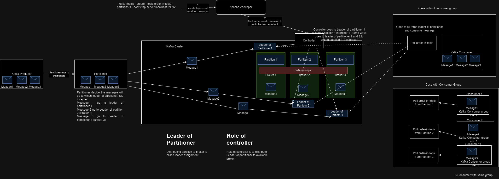
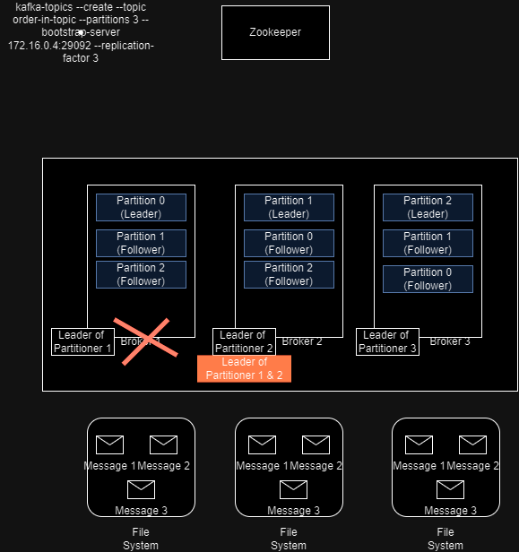

### Kafka Works in Distributed system


### Kafka Replication Factor

- we create topic using --replication-factor 3 and 3 partition and sent to Zookeper
- Zookeeper ask controller to create topic with 3 partition of 3 replication Factor
- Controller will go to Leader of Partition0 and create Leader Partition 0 and for 2 more copy it will go to next Leader of Partitioner and create Follow Partition 0.
- Controller will go to Leader of Partition1 and create Leader Partition 1 and for 2 more copy it will go to next Leader of Partitioner and create Follow Partition 1 .
- Controller will go to Leader of Partition2 and create Leader Partition 2 and for 2 more copy it will go to next Leader of Partitioner and create Follow Partition 2 .
- So when message come to Partition 0 it will store in Leader Partition 0 and will go to File system of broker 0
- And there will be 2 more copy created to Follower partition and go to File system of their broker.
- When Broker 0 goes down controller will make partition 1 as Leader of Partitioner 0 & 1 and message will be served from there.

### Min In-sync replica (ISR)
In-Sync replica represent no of messgae to be in sync amongst kafka cluster. It include followee and leader replica.
- Min in-sync replica should be > 1
- idea ISR value = replication-factor
- Can be set on broker and topic level.
```shell
sh-4.4$ kafka-topics  --describe --topic order-in-topic  --bootstrap-server 172.16.0.4:29092,172.16.0.4:39092,172.16.0.4:39095
Topic: order-in-topic   TopicId: bXhedb8iRPqoNINI3ztyxQ PartitionCount: 3       ReplicationFactor: 3    Configs: 
        Topic: order-in-topic   Partition: 0    Leader: 1       Replicas: 1,2,3 Isr: 1,2,3
        Topic: order-in-topic   Partition: 1    Leader: 2       Replicas: 2,3,1 Isr: 2,3,1
        Topic: order-in-topic   Partition: 2    Leader: 3       Replicas: 3,1,2 Isr: 3,1,2
```
Making Broker 2 Down then ISR will change:
```shell
sh-4.4$ kafka-topics  --describe --topic order-in-topic  --bootstrap-server 172.16.0.4:29092,172.16.0.4:39092,172.16.0.4:39095
[2023-08-06 12:34:54,760] WARN [AdminClient clientId=adminclient-1] Connection to node -2 (/172.16.0.4:39092) could not be established. Broker may not be available. (org.apache.kafka.clients.NetworkClient)
Topic: order-in-topic   TopicId: bXhedb8iRPqoNINI3ztyxQ PartitionCount: 3       ReplicationFactor: 3    Configs: 
        Topic: order-in-topic   Partition: 0    Leader: 1       Replicas: 1,2,3 Isr: 1,3
        Topic: order-in-topic   Partition: 1    Leader: 3       Replicas: 2,3,1 Isr: 3,1
        Topic: order-in-topic   Partition: 2    Leader: 3       Replicas: 3,1,2 Isr: 3,1
```

